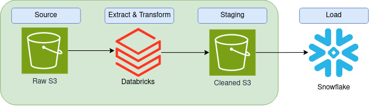

# **Kaitlyn Borski Week 5 ETL Project: Million Song Data Lake and Data Warehouse**

## **ETL Solution Architecture**


## **DDL SCRIPTS in Snowflake**

### Songs Table
```sql
CREATE OR REPLACE TRANSIENT TABLE TECHCATALYST_DE.KBORSKI.SONGS_DIM (
    SONG_ID STRING,
    TITLE STRING,
    ARTIST_ID STRING,
    YEAR INTEGER,
    DURATION NUMBER(10,5)
);
```

### User Table
```sql
CREATE OR REPLACE TRANSIENT TABLE TECHCATALYST_DE.KBORSKI.USER_DIM (
    ID STRING,
    FIRSTNAME STRING,
    LASTNAME STRING,
    GENDER STRING,
    LEVEL STRING
);
```

### Time Table
```sql
CREATE OR REPLACE TRANSIENT TABLE TECHCATALYST_DE.KBORSKI.TIME_DIM (
    TS BIGINT,
    DATETIME STRING,
    START_TIME STRING,
    "YEAR" STRING,
    "MONTH" STRING,
    DAYOFMONTH INTEGER,
    WEEKOFYEAR INTEGER
);
```

### Artist Table
```sql
CREATE OR REPLACE TRANSIENT TABLE TECHCATALYST_DE.KBORSKI.ARTIST_DIM (
    ARTIST_ID STRING,
    ARTIST_NAME STRING,
    ARTIST_LOCATION STRING,
    ARTIST_LATITUDE NUMBER(10,5),
    ARTIST_LONGITUDE NUMBER(10,5)
);
```

### Songplays Table
```sql
CREATE OR REPLACE TRANSIENT TABLE TECHCATALYST_DE.KBORSKI.SONGPLAYS_FACT (
    SONGPLAY_ID INTEGER,
    DATETIME_ID BIGINT,
    USER_ID STRING,
    LEVEL STRING,
    SONG_ID STRING,
    ARTIST_ID STRING,
    SESSION_ID BIGINT,
    LOCATION STRING,
    USER_AGENT STRING
);
```

## **Using the Data Lake and Data Warehouse**
### Data Lake
- Stores all raw and transformed data, which supports scalability for Sparkify's growing data needs
- Acts as an intermediate storage for data before loading into the Data Warehouse, which ensures quality and consistency of data

### Data Warehouse
- Designed for high-performance querying and analysis with structured data in fact and dimension tables
- Provides a reliable source of truth for analytics, integrating with BI tools for insights and visualizations